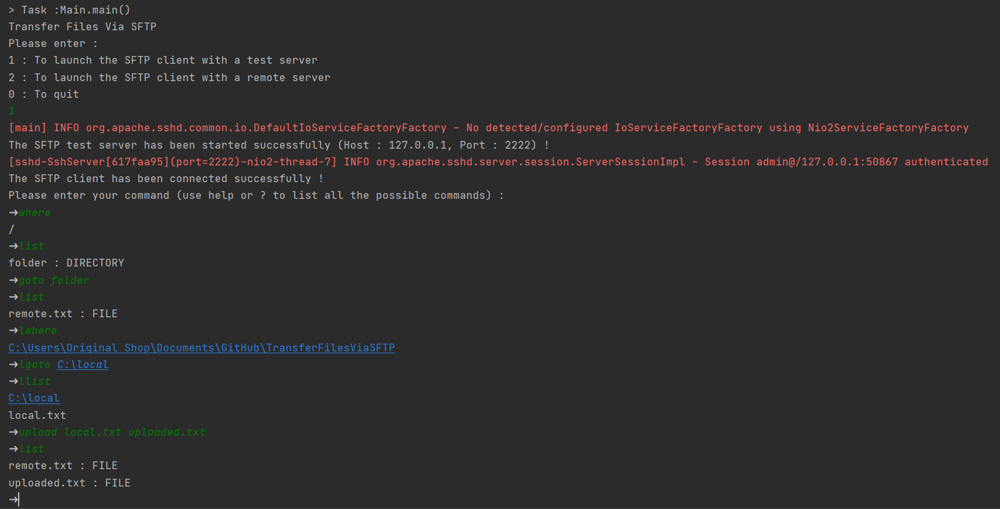
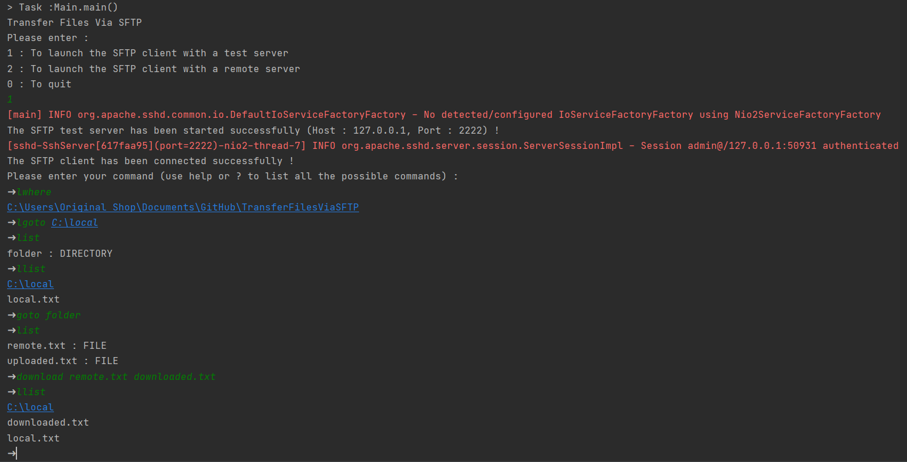
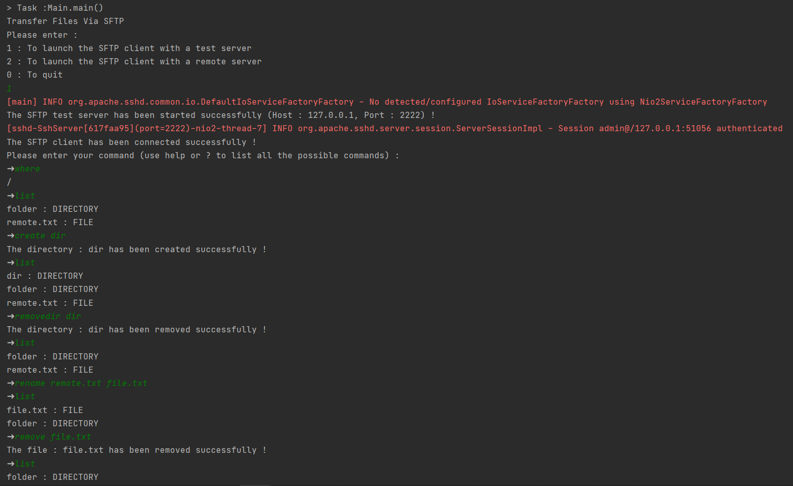

# TransferFilesViaSFTP
> A JAVA console application to transfer files via SFTP


## About The Project

This project is a JAVA console application, that allow the user to connect to a remote SFTP server, and transfer files.

It is able to :
* Launch the SFTP client with a test server
* Launch the SFTP client with a remote server
* The user can customize the commands using the file SftpCommands.java

## Built With

This project is built with these libraries :

* [Apache SSHD](https://mina.apache.org/sshd-project)
* [Jsch](http://www.jcraft.com/jsch)

## Getting Started

In order to run this project, you need to install any JAVA IDE (IntelliJ IDEA is preferred) and JDK 8.

## Screenshots
1 - Upload a file :


2 - Download a file :


3 - Other Commands :



## Usage

Available commands :
```
bye                                Quit sftp
goto path                          Change remote directory to 'path'
chmod mode path                    Change permissions of file 'path' to 'mode'
exit                               Quit sftp
download remote [local]            Download file
help                               Display this help text
lgoto path                         Change local directory to 'path'
llist [ls-options [path]]          Display local directory listing
lcreate path                       Create local directory
list [path]                        Display remote directory listing
create path                        Create remote directory
upload local [remote]              Upload file
quit                               Quit sftp
rename oldpath newpath             Rename remote file
remove path                        Delete remote file
removedir path                     Delete remote directory
?                                  Synonym for help
```

## Examples

1 - Upload a file :
```sh
   where
   goto remote/folder
   list
   lwhere
   lgoto local/folder
   llist
   upload local.txt remote.txt
   list
```
2 - Download a file :
```sh
   where
   goto remote/folder
   list
   lwhere
   lgoto local/folder
   llist
   download remote.txt local.txt
   list
```
2 - Other commands :
```sh
   create dir
   removedir dir
   rename file.txt new.txt
   chmod 777 new.txt
   remove new.txt
   lgoto C:\local
   lwhere
   lcreate folder
   llist
```

## Contributing

1. Fork it (<https://github.com/AmineElkhalidy/TransferFilesViaSFTP>)
2. Create your feature branch (`git checkout -b feature/Myfeature`)
3. Commit your changes (`git commit -am 'Add some Myfeature'`)
4. Push to the branch (`git push origin feature/Myfeature`)
5. Create a new Pull Request

## License

Distributed under the MIT License. See `LICENSE` for more information.

## Contact

- Amine Elkhalidy - amineelkhalidy.a@gmail.com
- Karima Jarmoumi - karima.jarmoumi@gmail.com
- Safaa Khadda - khaddasafaa@gmail.com
